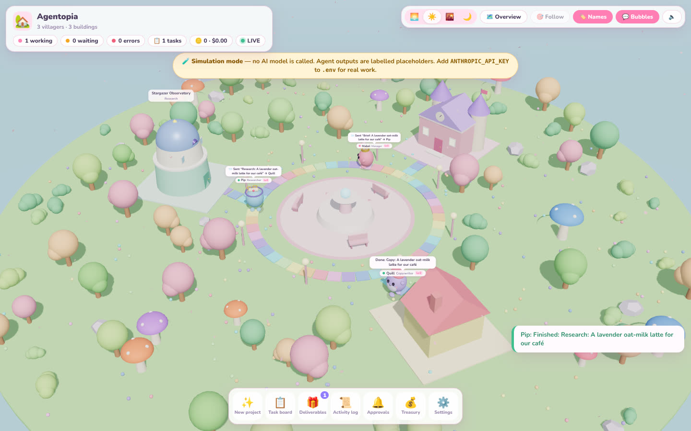
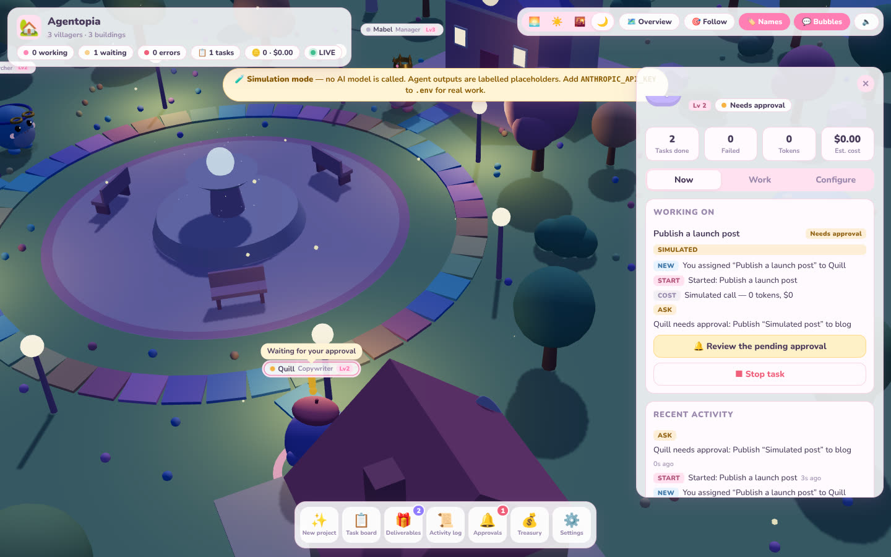

# 🏡 Agentopia

**An isometric AI town where every villager is a real, configurable AI employee.**

Agentopia turns running an autonomous AI workforce into a cosy life-simulation game. Each round little
villager is a working agent with its own system prompt, model, skills, task queue, schedule, budget and
cost ledger. When the Manager hands research to the Researcher, you watch her walk the brief across
town. That walk happens because the hand-off happened in the database. Nothing on screen is faked progress.




<sub>Screenshots from the offline simulation mode (hence the banner). With an API key, the same flows run on Claude.</sub>

> **Status: v0.2 (Phase 2: Autonomy).** Schedules, 24/7 workers, strict budgets, hiring, custom
> departments and modular skills. **The live Claude API path has not yet been verified against a real key.**
> Run `npm run verify:live` (below). See [docs/PHASE2.md](docs/PHASE2.md) for exactly what is verified and how.

---

## Quick start

Requirements: **Node.js ≥ 22.13** (it uses the built-in `node:sqlite`, so there is no native build step).

```bash
npm install
cp .env.example .env          # put your key in ANTHROPIC_API_KEY=...
npm run verify:live           # optional: prove the integration works (~$0.10–0.50, capped)
npm run dev                   # API + worker on :8787, web client on http://127.0.0.1:5173
```

Open **http://127.0.0.1:5173** and:

- **✨ New project**: pick a team, describe a product, and watch brief → research → copy → review become a deliverable.
- **🏘️ Town**: hire villagers from templates (Engineer, Analyst, Designer, …) and build departments for them.
- **📅 Schedules**: make work recur daily, weekly or every N minutes. It runs on the server with the browser closed.
- **⚙️ Settings**: test the connection, see live-verification results, workers and budget limits.

**No API key yet?** Set `AGENTOPIA_SIMULATION=true` to explore offline. Simulated work is labelled
**SIMULATED** everywhere, costs $0 and never calls a model. A real key always wins over simulation.

**24/7 on a server:** `docker compose up -d` runs an API container and a separate worker container.
See [docs/DEPLOYMENT.md](docs/DEPLOYMENT.md).

| Script | What it does |
|---|---|
| `npm run dev` | API + worker (auto-reload) + Vite dev client |
| `npm run build` / `npm start` | Build the client; run everything in one production process |
| `npm run start:api` / `npm run start:worker` | Run the HTTP API and the background worker as separate processes |
| `npm run verify:live` | Real, budget-capped checks of every Claude capability plus an end-to-end agent task |
| `npm run backup` | Consistent online backup of the database |
| `npm test` / `npm run typecheck` | 66 automated tests / TypeScript across server, client, scripts and tests |

---

## What's real, what's verified

| Capability | Status |
|---|---|
| Claude API (streaming, effort, prompt caching, refusal fallback) | **Implemented.** Request format tested; **live calls not yet verified** (run `verify:live`) |
| Web research: hosted web search + web fetch | **Implemented**, same caveat. Search billed per use |
| Coding skill: Anthropic's code-execution sandbox | **Implemented**, same caveat. Sandbox has no internet and no access to your machine |
| Proof of execution | Every real call stores its Anthropic **request id**; tasks show **LIVE** only with recorded ids |
| Task queue, priorities, dependencies, retries, crash recovery, cancellation | **Verified** (tests + real containers) |
| Recurring schedules (DST-safe, exactly-once, catch-up once, overlap skip) | **Verified** (tests) |
| Split API/worker processes, health and readiness, Docker Compose, auto-restart | **Verified** (tests + real Docker run) |
| Budgets: daily / monthly / per-task / per-villager, worst case reserved before each call | **Verified** (tests) |
| Hire / archive / restore villagers; custom departments and buildings | **Verified** (tests + browser) |
| Human approval gate for sensitive actions | **Verified** |
| Publishing, email | **Placeholder.** Approved actions are recorded, nothing is sent |
| Image generation, 3D modeling | **Planned** skill slots: attachable, clearly inactive |
| Token and cost tracking | Real token counts, **estimated** dollars ([docs/COSTS.md](docs/COSTS.md)) |
| Weekly Town Tax | Calculator only. Never moves money |
| Levels / XP | Cosmetic, from completed tasks |

---

## Architecture at a glance

```
 browser (React + R3F)                 api process (Hono)                    worker process(es)
 ┌──────────────────────┐   HTTP   ┌───────────────────────────┐        ┌─────────────────────────────┐
 │ theme-engine + theme │ ───────▶ │ REST: agents, buildings,  │        │ TaskRunner: claim → execute │
 │ world (real events)  │ ◀─SSE─── │ tasks, schedules, budgets │        │ Scheduler: due → tasks      │
 │ HUD, panels          │          │ SSE tails the events table│        │ Executor: tool loop, skills,│
 └──────────────────────┘          └─────────────┬─────────────┘        │ approvals, budget preflight │
                                                 │      SQLite (WAL)    └──────────────┬──────────────┘
                                                 └──────────────┬──────────────────────┘
                                                        tasks · schedules · events · usage · workers
```

- **Server is the source of truth.** The browser only renders state and sends commands.
- **Skills are modules** (`server/skills/*.ts`). Each declares its tools, prompt guidance, cost note and verification check.
- **Themes are pure presentation** (`web/src/themes/*`). They can be swapped without touching agents, tasks or data. See [docs/THEMES.md](docs/THEMES.md).

Docs: [Architecture](docs/ARCHITECTURE.md) · [Deployment](docs/DEPLOYMENT.md) · [Costs](docs/COSTS.md) ·
[Security](docs/SECURITY.md) · [Install](docs/INSTALL.md) · [Themes](docs/THEMES.md) ·
[Phase 2 report](docs/PHASE2.md) · [Roadmap](docs/ROADMAP.md)

---

## Licence & assets

All 3D assets are original and built from primitives in code. No third-party characters or artwork are used.
Licence: proprietary / UNLICENSED for now (commercial product in development).
